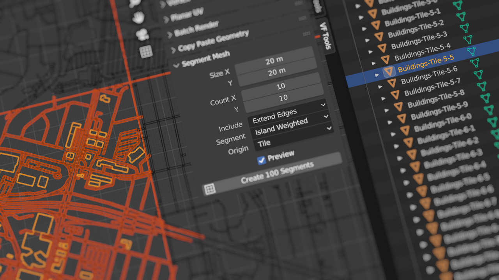

# VF-BlenderSegmentMesh
Divides a mesh (such as OpenStreetMap 3D meshes) into XY grid segments for more efficient view culling in realtime rendering engines like Unity, Unreal Engine, and Godot.

## Installation and Usage

- Download [VF_segmentMesh.py](https://raw.githubusercontent.com/jeinselen/VF-BlenderSegmentMesh/main/VF_segmentMesh.py)
- Open Blender Preferences and navigate to the "Add-ons" tab
- Install and enable the add-on
- It will show up in the 3D view `VF Tools` tab
- Select a single mesh object to segment
	- **WARNING:** segmenting large meshes can take a long time (measured in minutes, not seconds!)

## Settings

- `Size` Sets the `X` and `Y` dimensions of a single tile
- `Count` Sets the number of tiles in `X` and `Y`
- `Include` Determines handling of geometry located outside of the total tiled area (tile size × tile count)
	- `Only Inside` - Limits each tile to just the elements that fall within the boundaries of that tile
	- `Extend Edges` - Includes geometry outside the boundaries of the total area in the nearest edge tile
- `Segment` The type of geometry location used to segment meshes between tiles
	- `Per Polygon` - Divides meshes at the polygon level using the average vertex position
		- This is particularly helpful for large objects that span multiple tiles (which would otherwise defeat the purpose of viewpoint culling)
	- `Island Average` - Iterates over every polygon to find connected mesh islands and uses the average vertex locations to determine if the group falls within the tile boundary
	- `Island Weighted` - Iterates over every polygon to find connected mesh islands and uses the average of weighted polygon locations to determine if the group falls within the tile boundary
- `Origin` Sets the origin type for the final tile objects
	- `Tile` - The centre point of each tile range
		- This can be ideal for predictable tile placement, but if the segmented geometry is entirely in one corner, may not be suitable for transparency sorting in some situations
	- `Bounding Box` - The bounding box of the segmented geometry
	- `Median` - The median point of the segmented geometry positions
	- `Mass` - The mass of the segmented geometry
	- `Volume` - The volume of the segmented geometry
- `Preview` creates a temporary mesh object to show the resulting grid based on the tile size and count

## Notes

- Geometry Nodes are used to store island location information as face attributes. Any other modifiers on the source mesh will _not_ be applied during this process; the base mesh is what will be segmented, and any modifiers will still be present for each of the segments.
- This software is provided without guarantee of usability or safety, use at your own risk
